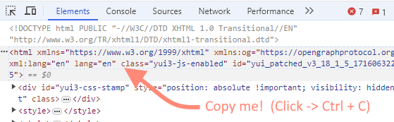
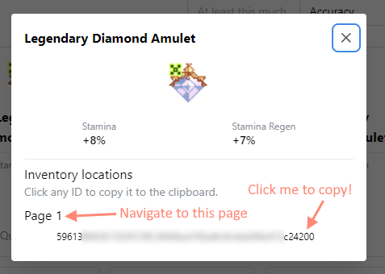
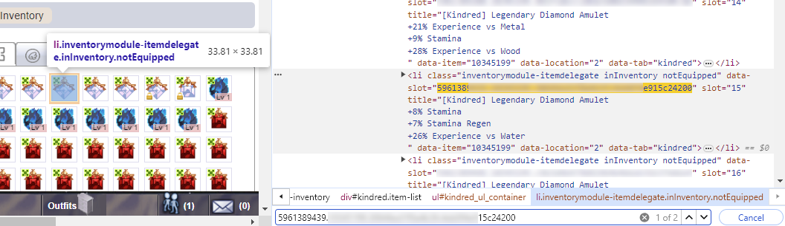

# Gaia Online amulet search

A tool allowing you to paste the HTML (hopefully soon to be simplified) of a particular page,
resulting in a clean and filterable collection of results, where such functionality is lacking in Gaia Online.

## How to use
These steps may take 2 minutes the first time, and 30s once you get used to the process.
1. visit the URL (link coming soon)
2. in another tab, open a Gaia Online [trade](https://www.gaiaonline.com/gaia/bank.php) with any user
3. click the Kindred tab
4. navigate to whichever page number you wish to load first (or stay on Page #1)
5. **wait for the items to load in the trade window**
6. view the page's HTML (typically done by pressing F12 and clicking the Elements tab)
7. scroll to the top and copy the topmost `<html ...` line (see below)

8. paste it into the 'Amulet Search' textbox, **and you're ready to go**! Unless..
9. if you need to load multiple pages, repeat steps 4 - 8 with different pages. A new text box will appear in which you can paste additional pages' HTML.

The results should be immediately displayed, and you can now start searching / filtering!

## I've found a nice amulet... but how can I identify it in the trade window?
1. In the Amulet Search (this tool), click the amulet you wish to find in trade.
2. You'll be shown the following details. Note the page number, and click the ID to copy

3. In the Trade window, navigate to the corresponding page number
4. Inspect Element, click anywhere in the HTML, and Ctrl+F to start a search
5. Paste the ID which is on your clipboard (from Step 2)
6. When you hover over the highlighted entry, the relevant amulet should highlight in the trade window. Click it to add to trade!

## Why is this necessary?
- Stats are paramount for an amulet, but Gaia lacks a way to search/filter by stats.
- If you have many amulets, it can take anywhere from 15 minutes to multiple hours to find the correct one manually; and it sure strains the eyes!
### Why so many steps?
- Gaia takes a hard stance against bots/scripts/etc. and I decided not to test the line. I may make this process easier in the future, but the options may be limited considering the rules.